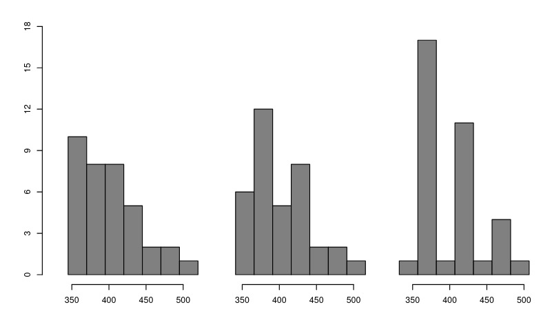
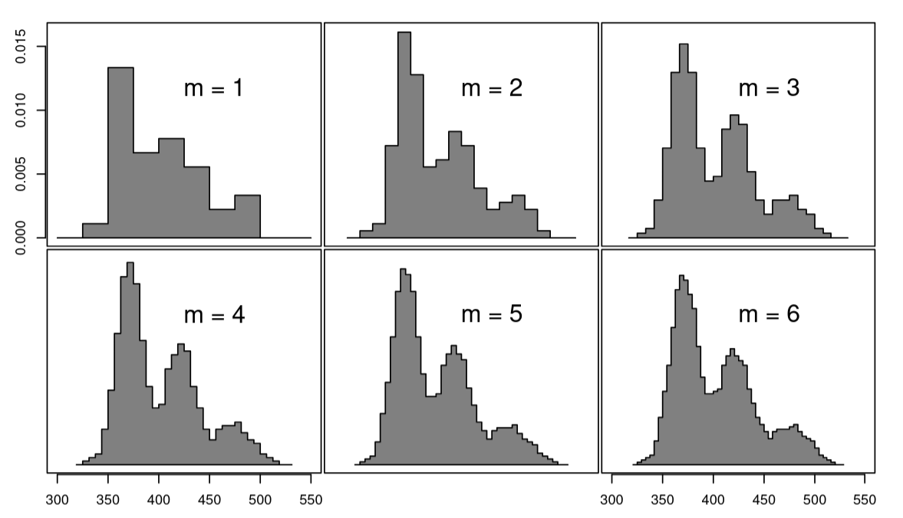

The histogram is without doubt the oldest and most widely used nonparametric density estimation tool - probably thanks to its interpretability and efficient implementation.
For 1D data, it is formed by dividing $\R$ into equal sized intervals called *bins*, counting the number of points falling into each bin, and reporting the result with a piecewise constant function.

Formaly, given a fixed bin width $h > 0$, let $B_k = [t_k, t_{k+1})$ be the k-th interval, with $h = t_{k+1} - t_k$.
Given $N$ random samples $\{ x_1, \dots, x_N \}$, 
we denote by $\nu_k$ be the number of point belonging to bin $B_k$:

$$ \nu_k = \sum_{i=1}^N I(x_i \in B_k) $$

The histogram is then the resulting step-wise function:
$$\hat f(x) = \frac{1}{Nh} \sum_{k} \nu_k I(x \in B_k) = 
\begin{cases}
\frac{1}{Nh}\nu_k & \text{if } x \in B_k \\
0 & \text{otherwise.}
\end{cases}
$$

Clearly, $\sum_k \nu_k = N$ and $\int {\hat f} = 1$. 

The naive histogram implementation computation is extremely efficient: 
for a given value $x_i$, one can compute the corresponding index, $p = \lfloor \frac{x_i}{h} \rfloor$, and increment a pre-allocated array at the corresponding index, `array[p] += 1`. 
This yields a $\mathcal O(N)$ complexity algorithm - moreover, with only one scan over the data - where $N$ is the number of input data points.

At first glence, histogram is only govern by one parameter (just like more complexe non-parametric distribution estimation methods like KDE), that is the bin size - or bandwitch - $h$.
But there is one hidden parameter that is often left aside: **the origin offset $t_0$**.
While it may seems innofensif, changing $t_0$ may have great consequences on the final graph.
The following figure () shows histograms of the estimated distance (in feet) of Sammy Sosa’s 36 home runs hit at at home in Chicago’s Wrigley Field among the 66 home runs he scored during the 1998 baseball season. 
Each histograms has a bin size of 25 feets but three different choice of $t_0$:

As one may see, they look very different from each other, highlingting the impact of the choice of $t_0$.
Furthemore, as shown by , assuming one kowns the sampling density $f$ (which we don't in practice), the "optimal" bin width formula in some sens is: 

$$
h^* = \left[ \frac{6}{n\int f'(x)^2 dx} \right]^{1/3}
$$

One may notice than $t_0$ is not part of this formula; therefore, it makes sens to treat $t_0$ as a nuisance parameter, that should not have such an important impact on the end-result.

## Average shifted histogram (ASH)

To minimize the impact of $t_0$ on the end results,  have proposed a new method called **average shifted histogram** (ASH).

The core idea is simple: given a bin size $h$ and an integer $n$, compute $m$ histograms all with bin size $h$ but with a respective shifted origin $t_0^{(j)} = t_0 + jh/m$ for $j$ in $\{0, \dots, m-1\}$.
All those histograms are then averaged together, yielding a new histogram with bin size $h/m$.
The result is a smoother histogram, as depicted in the next figure () with for different value for $m$:

Let's frame this with mathematical terms.
To simplify the notation, we are goin to assume (without loss of generality) that $t_0=0$ and we only focus on the first large bin $B_0$.

Say we want to compute the ASH for $m$ histgrams.
Let $\delta = h/m$ be the atomique shift that will be added to each histogram.
The first histogram will be computed with a first bin $B_0^{(0)}$ = 

We are going to split the previous bin $B_k = [kh, (k+1)h)$ into $m$ smaller bins $b_k^{(0)}, \dots, b_k^{(m-1)}$ of size $h/m$, i.e. $b_k^{(p)} = [(km + p)h/m, (km + p + 1)h/m)$.
meaning by construction, $B_k = \bigcup_{p=0}^{m-1} b_k^{(p)}$.

The default basic histogram uses the bins $B_k$.
As the origin shift is 

## Kernel implementation
Swapping sums in Equation yields a new equivalent formulation for this problem: 

So instead of managing $d$ histograms concurrently, one can store a high resolution histogram of bin size $h/d$, and at the last moment apply the following weights:

This is equivalent to convolution with a triangular kernel of size $2m + 1$  as the complexity of computing an histogram does not depend of the bin size, fitting it with $N$ values can be done in $\mathcal O(N$) for an identical memory cost that ASH. To produce a smoother images, a common approach is to change this kernel for smoother alternative, for instance the triweight kernel:

## Relation with kernel density estimation (KDE)

When $d \rightarrow \infty$, ASH effectively becomes equivalent to KDE with the before-mentioned kernel. Scott's notice that results becomes almost indistinguishable from KDE for $d \sim 7$, yielding a faster approximation for those methods.

## Generalization to higher dimensions
ASH generalize trivially to multiple dimensions 

## Application to SMLM
I dove into ASH theory as part of my PhD thesis about Single molecule localization microscopy, where ASH is commonly use to efficiently render 2D images of structure. It was first introduced by

A little modification 

Implementation can be found in my github repository; at the time of writting, here is the current version

https://www.researchgate.net/profile/David-Scott-57/publication/229760716_Averaged_Shifted_Histogram/links/5be5923b4585150b2ba96e38/Averaged-Shifted-Histogram.pdf?origin=publication_detail&_tp=eyJjb250ZXh0Ijp7ImZpcnN0UGFnZSI6InB1YmxpY2F0aW9uRG93bmxvYWQiLCJwYWdlIjoicHVibGljYXRpb25Eb3dubG9hZCIsInByZXZpb3VzUGFnZSI6InB1YmxpY2F0aW9uIn19

Section 3.8.1 https://dspace.cuni.cz/bitstream/handle/20.500.11956/2117/IPTX_2013_1_11110_0_406481_0_147751.pdf?sequence=1

