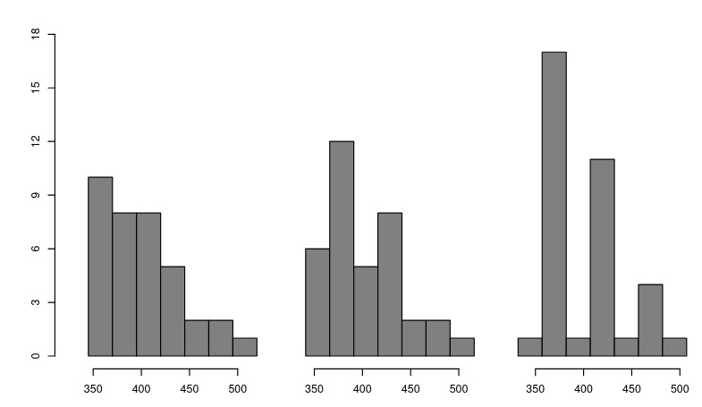
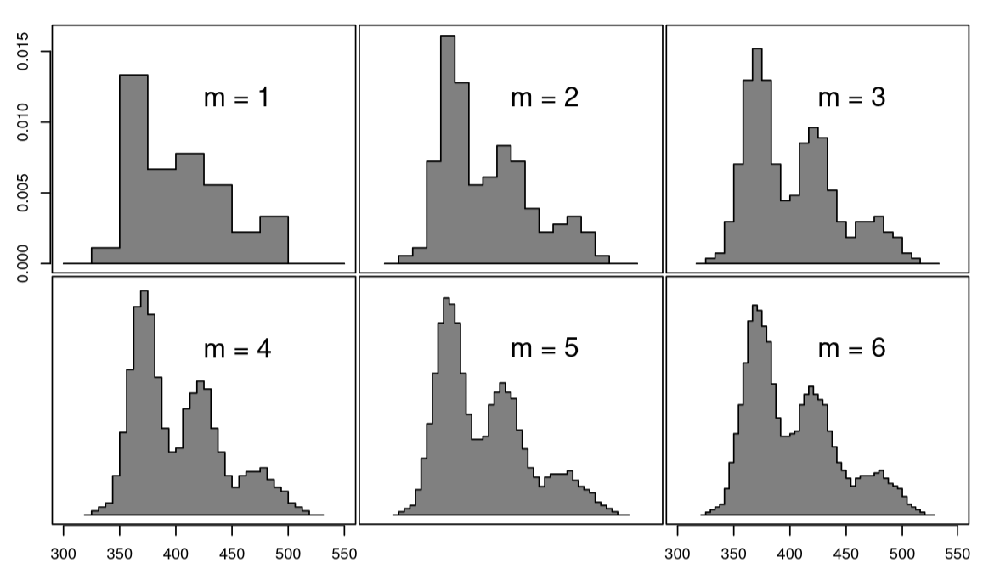

The histogram is without doubt the oldest and most widely used nonparametric density estimation tool - probably thanks to its interpretability and efficient implementation.
For 1D data, it is formed by first dividing $\R$ into equal-sized intervals called *bins*, then counting the number of points falling into each bin, and ultimately reporting the result through a piecewise constant function.

Formally, given a fixed bin width $h > 0$ and an origin $t_0$, let $B_k^{(0)} = [t_0 + kh, t_0 + (k+1)h)$ be the k-th interval.
Given $N$ random samples $\{ x_1, \dots, x_N \}$, 
we denote by $\nu: \mathcal P(\R) \to \N$ the normalized counting operator of our dataset, that returns the ratio of points belonging to a given subset $\gE$ of $\R$:

$$ \nu (\gE) = \frac{1}{N} \sum_{i=1}^N \1(x_i \in \gE) $$

We define the histogram as the following step-wise function:
$$\hat f(x) = \frac{1}{h} \sum_{k} \1(x \in B_k^{(0)}) \nu (B_k^{(0)}) =
\frac{1}{h} \nu (B_k^{(0)}) 
\; \text{where} \; k \; \text{is such that} \; x \in B_k^{(0)}
$$

Clearly, $\sum_k \nu (B_k^{(0)}) = 1$ and $\int {\hat f} = 1$. 

The naive histogram implementation computation is extremely efficient: 
for a given value $x_i$, one can compute the corresponding index, $p = \lfloor \frac{x_i}{h} \rfloor$, and increment a pre-allocated array at the corresponding index, `array[p] += 1`. 
This yields a $\mathcal O(N)$ complexity algorithm - moreover, with only one scan over the data - where $N$ is the number of input data points.

At first glance, histogram is only governed by one parameter (just like more complex non-parametric distribution estimation methods like KDE), that is the bin size - or bandwidth - $h$.
But there is one hidden parameter that is often left aside: **the origin offset $t_0$**.
While it may seem inoffensive, changing $t_0$ may have great consequences on the final graph.
The following figure () shows histograms of the estimated distance (in feet) of Sammy Sosa’s 36 home runs hit at at home in Chicago’s Wrigley Field among the 66 home runs he scored during the 1998 baseball season. 
Each histogram has a bin size of 25 feet but three different choices of $t_0$:



As one may see, they look very different from each other, highlighting the impact of the choice of $t_0$.
Furthermore, as shown by , assuming one knows the sampling density $f$ (which we don't in practice), the "optimal" bin width formula in some sense is: 

$$
h^* = \left[ \frac{6}{N\int f'(x)^2 dx} \right]^{1/3}
$$

One may notice that $t_0$ is not part of this formula; therefore, it makes sense to treat $t_0$ as a nuisance parameter, that should not have such an important impact on the end-result.

## Average shifted histogram (ASH)

To minimize the impact of $t_0$ on the end results,  have proposed a new method called **average shifted histogram** (ASH).

The core idea is simple: given a bin size $h$ and an integer $n$, compute $m$ histograms all with the same bin size $h$ but with **shifted origins**, and
**average them all together** to yield a new histogram.
The result is a smoother histogram with bin size $h/m$, as depicted in the next figure () for different values of $m$:




Let's frame this mathematically.
Following , we consider $m$ histograms all with a respective origin shifted by $1/m$-th of the standard bin size $h$, or in other words the origin of the $j$-th histogram with $0 \leq j \leq m - 1$ is $t_0^{(j)} = t_0 + j\frac{h}{m}$.

In other words, the $j$-th histogram $\hat f^{(j)}$ - that is shifted by $jh/m$ with respect to the initial origin $t_0$ - is computed over the bins $B_k^{(j)} = \left[ t_0 + j\frac{h}{m} + kh, t_0 + j\frac{h}{m} + (k+1)h \right)$.
This yields the following definition:

$$
\hat f^{(j)}(x) = \frac{1}{h} \sum_{k} \1(x \in B_k^{(j)}) \nu (B_k^{(j)})
$$

And the resulting ASH is:

$$
\hat f(x) = \frac{1}{m} \sum_{j=0}^{m-1} \hat f^{(j)}(x) = \frac{1}{mh} \sum_{j=0}^{m-1} \sum_{k} \1(x \in B_k^{(j)}) \nu (B_k^{(j)})
$$


## Kernel implementation

The previous equation can be simplified by subdividing $\R$ with smaller bins $b_k$ of size $h/m$: $b_k = \left[ t_0 + kh/m, t_0 + (k+1)h/m \right)$. 
With this new subdivision, one may notice that each $B_k^{(j)}$ can be decomposed as a union of those atomic bins:

$$
B_k^{(j)} = \bigcup_{p=0}^{m -1} b_{km+j+p}
.
$$

As the $b_p$ are a partition of $\R$, we have $\1(x \in B_k^{(j)}) = \sum_{p=0}^{m-1} \1(x \in b_{km+j+p})$, from which we can derive $\nu (B_k^{(j)}) = \sum_{p=0}^{m-1} \nu \left( b_{km+j+p} \right)$. 
Finally, injecting this definition into $\hat f$ yields:

$$
\hat f(x) = \frac{1}{mh} \sum_{k} \sum_{j=0}^{m-1} \sum_{p=0}^{m-1} \sum_{q=0}^{m-1} \1(x \in b_{km+j+q}) \nu \left( b_{km+j+p} \right)
$$

Well, I agree that it does not look simplified at all.
To simplify this, let's pause a minute and consider the different roles of the terms of this sum.
After careful inspection, **the previous expression of $\hat f(x)$ is only a weighted sum of the count values of other bins, with a coefficient that depends on the anchor bin containing $x$** ($b_{km+j+q}$ in the equation) **and the considered bin whose value interests us** ($b_{km+j+p}$ in the equation). 
If we can find the number of times the count value $\nu \left( b_s \right)$ of a specific bin $b_s$ interacts when $x$ belongs to another anchor bin $b_r$, if we denote this number $C_{s,r}$, then we could re-write this equation in the form:

$$
\hat f(x) = \frac{1}{mh} \sum_{r} \sum_{s} \1(x \in b_{r}) C_{r,s} \nu \left( b_{s} \right)
$$

Therefore, let's consider the following question: 
**how many times does a specific neighbor bin $b_{s}$ (whose count value $\nu \left( b_{s} \right)$ is of interest) interact with another the anchor bin $b_{r}$ containing $x$ ?**

Let $D$ be the index-distance between those two bins.
We have that $D = s-r=km+j+p - (km+j+q) = p - q$. 
Both local sum indices $p$ and $q$ range from $0$ to $m-1$, taking $m$ different values: if we compute the matrix of differences $p-q$ for all possible pairs, we get:

$$
\begin{pmatrix}
0 & 1 & 2 & \dots & m-1 \\
-1 & 0 & 1 & \dots & m-2 \\
-2 & -1 & 0 & \dots & m-3 \\
\vdots & \vdots & \vdots & \ddots & \vdots \\
-m+1 & -m+2 & -m+3 & \dots & 0
\end{pmatrix}
$$

Say our target is a distance of 0; then we can visually read that there are exactly $m$ combinations of $p$ and $q$ that yield this null distance: they are the elements of the main diagonal. 
If we are looking for a target distance of $-1$, then there are $m-1$ combinations: those are the values on the lower sub-diagonal. 

Following this reasoning, you can convince yourself that the number of interactions between two bins separated by a distance of $p-q$ is exactly:
$$ C_{p-q} = \left( m - |p-q| \right)_+.$$

Plugging this into our previous equation yields the following form for  

$$
\hat f(x) = \frac{1}{mh} \sum_{r} \sum_{d} \1(x \in b_{r}) C_d \nu \left( b_{k+s} \right)
$$

Ultimately, those derivations lead us to the definition of a new piecewise constant function defined on the atomic bins $b_k$, but **in contrast to a classic histogram, the value associated to each bin is computed by applying a triangular convolution kernel** over the raw counts:

$$
\hat f(x) = \frac{1}{h} \sum_{k} \1(x \in b_{k}) \sum_{d=-m+1}^{m+1}K_d \nu \left( b_{d} \right)
\quad \text{where} \quad
K_d = \left( 1 - \frac{|d|}{m} \right)_+
$$

It should be noted that the previous derivations are not rigorous enough to be a proper demonstration: playing with intricated sums can quickly get technical, and we redirect the reader to  for detailed proofs.

Another - maybe more intuitive - way to understand this phenomenon is to realize that **ASH effectively convolves two rectangular functions** (also called [boxcar filters](https://en.wikipedia.org/wiki/Rectangular_function)), which naturally **yields a triangular kernel**.

All this theory yields a highly efficient implementation for ASH: instead of managing $m$ histograms concurrently, one can store a single high-resolution histogram of bin size $h/m$, and at the last moment convolve it with a triangular kernel of size $2m−1$.
Thus, ASH has a $\gO(N)$ computational complexity — similar to a simple histogram — but has a higher cost of $\gO(mN)$ in memory.

In practice, while the triangular kernel is the exact mathematical tool, it tends to produce noisy results. It is common practice to substitute it for a smoother kernel, for instance, the triweight kernel, as recommended by :

$$
K_d = \frac{35}{32}\left(1-\left(\frac{d}{m}\right)^2\right)_+^3
$$

Of course, any other kernel can be used; see the [Wikipedia list of regularly used kernels](https://en.wikipedia.org/wiki/Kernel_(statistics)#Kernel_functions_in_common_use) for other ideas.


## Relation with kernel density estimation (KDE)

As the number of shifts $m$ grows, the ASH estimator effectively converges to a standard KDE with a triangular kernel ().

In practice,  noted that the efficiency of the ASH becomes almost indistinguishable from the exact KDE for $m \geq 5$. 
At the same time, ASH provides a massive computational advantage compared to KDE : 
rather than evaluating the kernel function against every data point for every pixel, ASH aggregates the data once and smooths the bins directly. 
This yields a fast, high-quality approximation of KDE that scales well with both the number of points and the number of bins.

## Generalization to higher dimensions
ASH generalizes trivially to multiple dimensions, but unfortunately it scales poorly with the number of dimensions.

In dimension $n$, given an original bin size of $h^n$, one can compute a histogram with bin size $(h/m)^n$ and then perform the convolution over the high dimension grid.
This effectively averages $m^n$ shifted histograms.
Given the exponential scaling of the memory requirement with respect to $n$, 
I would not recommend ASH with high-dimensional data.

## Application to SMLM
I originally discovered ASH as an efficient visualization tool used in Single Molecule Localization Microscopy (SMLM). It allows one to efficiently render 2D images of biological structures using the localized coordinates. Applying this method to visualize SMLM data was first introduced by .

An example implementation can be found in my GitHub repository. 
Here it is at the time of writing:

```python
import torch
from torch import Tensor
from torch.nn.functional import conv2d
from torchmetrics import Metric

from smlmshot import utils


class AverageShiftedHistogram(Metric):
    """Render 2D visualizations of SMLM data by the average shifted histogram method."""

    full_state_update: bool = True

    def __init__(
        self,
        x0: float,
        y0: float,
        x1: float,
        y1: float,
        img_size: int | tuple[int, int],
        n_shifts: int = 2,
        kernel: str = "triweight",
        export_as_figure: bool = True,
    ):
        """Initialize the Average Shifted Histogram with physical coordinates.

        - x0, y0: The origin coordinates (top-left)
        - x1, y1: The end coordinates (bottom-right)
        - img_size: The desired output resolution (H, W)
        - smooth_factor: Determines the number of shifts.
        """
        super().__init__()
        self.register_buffer("origin", torch.tensor([x0, y0], dtype=torch.float32))
        self.H, self.W = utils.torch.to_pair(img_size)
        self.n_shifts = n_shifts
        kernel = utils.format.format_string(kernel)
        self.register_buffer("kernel", self.compute_kernel(kernel))
        self.export_as_figure = export_as_figure

        self.register_buffer(
            "bin_size", torch.tensor([abs(y1 - y0) / self.H, abs(x1 - x0) / self.W])
        )
        hist = torch.zeros((1, 1, self.H, self.W), dtype=torch.float)
        self.add_state("hist", default=hist, dist_reduce_fx="sum")

    @classmethod
    def from_magnification(
        cls,
        img_size: int | tuple[int, int],
        pixel_size: float | tuple[float] | Tensor,
        magnification: int = 2,
        sharpening_factor: float = 1.0,
        kernel: str = "triweight",
        export_as_figure: bool = True,
    ):
        """Initialize the Average Shifted Histogram.

        - img_size: the original image size
        - pixel_size: the original pixel size
        - magnification: controls the output image, that will be H * magn, W * magn
        - sharpening_factor: controls the resolvable distance of the output image.
        Resolvable distance will be pixel_size/sharpening_factor. Note that
        sharpening_factor must be <= than magnification.
        """
        if sharpening_factor > magnification:
            raise ValueError("sharpening_factor must be <= than magnification.")

        H_orig, W_orig = utils.torch.to_pair(img_size)
        pixel_size = utils.torch.to_pair(pixel_size)
        pixel_size = torch.as_tensor(pixel_size)

        H, W = H_orig * magnification, W_orig * magnification
        x0, y0 = 0.0, 0.0
        x1, y1 = W_orig * pixel_size[0], H_orig * pixel_size[1]
        n_shifts = int(round(magnification / sharpening_factor))
        return cls(
            x0=x0,
            y0=y0,
            x1=x1,
            y1=y1,
            img_size=(H, W),
            n_shifts=n_shifts,
            kernel=kernel,
            export_as_figure=export_as_figure,
        )

    @staticmethod
    def get_kernel(name: str):
        """Map kernel names to their implementation."""
        if name == "triangular":
            return lambda u: (1.0 - u.abs()).clip(min=0.0)
        if name == "triweight":
            return lambda u: (1.0 - u.square()).pow(3).clip(min=0.0)
        raise ValueError(
            f"Supported kernels are triangular and triweight, found {name}."
        )

    def compute_kernel(self, name: str):
        """Return the 2D convolution kernel needed to smooth the HD histogram."""
        kernel_func = self.get_kernel(name)
        u = torch.linspace(-1.0, 1.0, steps=2 * self.n_shifts + 1, device=self.device)
        kernel_1d = kernel_func(u[1:-1])  # edges are always 0
        kernel_2d = torch.outer(kernel_1d, kernel_1d)
        kernel_2d = kernel_2d / kernel_2d.sum()
        return kernel_2d[None, None]  # pad for conv2d

    def get_output_img_size(self) -> [int, int]:
        """Return the output image size."""
        return self.H, self.W

    def get_output_pixel_size(self) -> Tensor:
        """Return the output image size."""
        return self.bin_size

    def update(self, xy: Tensor | list[Tensor]):
        """Update the high resolution histogram with the new values.

        Fastest implementation on GPU seems to rely on torch.bincount.
        """
        if isinstance(xy, list):
            xy = [e[..., :2] for e in xy]
            xy = torch.cat(xy, dim=0)
        xy = xy[..., :2].reshape(-1, 2)  # (N, 2), flatten potential batch size
        xy = xy.to(self.device)

        xy = xy - self.origin
        xy = xy[:, None]
        xy = xy / self.bin_size
        indices = xy.floor().long()

        mask = (
            (indices[..., 0] >= 0)
            & (indices[..., 0] < self.W)
            & (indices[..., 1] >= 0)
            & (indices[..., 1] < self.H)
        )
        indices = indices[mask]
        indices = indices[:, 1] * self.W + indices[:, 0]

        counts = torch.bincount(indices, minlength=self.hist.numel())
        self.hist += counts.view(*self.hist.shape).float()

    def compute(self):
        """Compute the ASH by convolving with a kernel the HR histogram."""
        ash = conv2d(self.hist, self.kernel, padding="same")[0, 0]
        if not self.export_as_figure:
            return ash

        img_extent = utils.extent.get_img_extent(
            h=self.H, w=self.W, pixel_size=self.bin_size
        )
        utils.plot.clf()
        utils.plot.imshow(ash, img_extent=img_extent)
        return utils.plot.plt.gcf()

```