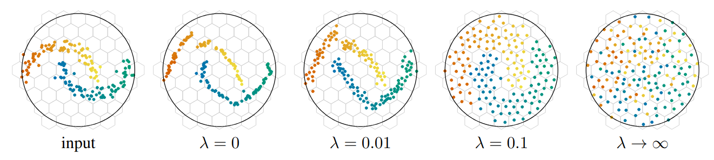

In manifold learning, a standard desire is to cover the latent space as much as possible.
Indeed, imagine learning a latent space of dimension 3 and ending up with a network that only uses a subset of it, say only one dimension:
it feels like wasted resources.
In self-supervised learning representation works such as DinoV2 (), their goal is to provide a meaningful embedding to all natural images.
Therefore, it makes sense to design such a latent space such that if we take a random natural image $\rvx \in \rho_\text{natural images}$ and process it with dino $\rvy = \operatorname{Dino}(\rvx)$,
then the resulting distribution of embeddings, i.e. the distribution of $\rvy$, spreads nicely and uniformly over the manifold (in the case of Dino, the manifold is the d-dimensional hyperball).

To this end, the machine learning community has been in search of a regularization that would encourage the uniform spreading of embeddings.
That is precisely the topic of today's post, with a small dive into the *KoLeo regularizer!*

## A geometric interpretation
Let's start by directly tackling the regularization proposed by .
Let's define $N$ vectors $\vx_1, \dots, \vx_n$ of $\R^d$.
The KoLeo regularizer is:

$$\mathcal L_\text{KoLeo} = -\sum_{i=1}^N \log \min_{j \neq i} || \vx_i - \vx_j ||.$$

From a geometric point of view, this corresponds to the average negative log distance of each point to its nearest neighbour.
Therefore, minimizing $\mathcal L_\text{KoLeo}$ effectively maximizes the quantities $|| \vx_i - \vx_j ||$, repulsing vectors away from one another with a force that is decreasing and concave with respect to the distance to their closest neighbour.
If we ignore the logarithm for a second, one may think of it as compressed springs repulsing each pair of close embeddings, just like [Hooke's law](https://en.wikipedia.org/wiki/Hooke's_law) creates a repulsive force that is proportional to the extension/compression for extended/compressed springs.

Here is an illustration () of its impact when paired with another loss function through a parameter $\lambda$:

Note that the embeddings need to belong to a bounded support, otherwise the regularization pushes them away to infinity.

But where does this formula come from?
The KoLeo regularizer is derived from the *Kozachenko–Leonenko differential entropy estimator* ().
Back in your physics or information classes, you may have seen that the entropy is, for a discrete distribution,
a measure of its information content, that is maximized for the uniform distribution.
For continuous variables, the analogue is the differential entropy, that is defined as.
While it does not retain all the convenient properties of its original, it enjoys
one that is of interest to us: on a bounded fixed support, the differential entropy is maximized by the uniform distribution.

The connection between the differential entropy and our initial problematic is thus immediate: to nicely spread embeddings - i.e. getting close to a uniform distribution in the latent space - an alternative option is to **maximize the entropy of the distribution of the embeddings**.

And it turns out that the Kozachenko–Leonenko differential entropy estimator, as its name suggests, is precisely an estimator of the differential entropy of a distribution given only samples from it.
Given samples $\vx_0, \dots, \vx_N \in \R^d$ i.i.d from a distribution $\rho$ with finite support, the Kozachenko–Leonenko estimator writes:

$$ H_N = \frac{d}{N+1} \sum_{i=0}^N {\log \min_{j \neq i} || \vx_i - \vx_j ||} + \log N + \gamma + \log V_1$$

where $V_1$ is the volume of the unit-ball $V_1 = \int_{\sB(0, 1)}$ and $\gamma$ is [Euler's constant](https://en.wikipedia.org/wiki/Euler's_constant).
Assuming that $N$ (i.e. the batch size) and $d$ (the embedding dimension) are constants in a deep learning framework,
we see that maximizing $H_N$ is equivalent to maximizing $\mathcal{L}_\text{KoLeo}$ (which are, with those considerations, equal up to a negative scale and an offset).

## A quick proof by hand
You have been waiting for this moment for so long and now it is finaly happening:
you are at your favorite artist biggest show of the decade (which must be the Red Hot Chillie Paper, I have no doubt about it).
Here is a plan of the stade de france with the density of the crowd:

Naturally, the room density is non-uniform - everyones want's to be as close as possible to - and back corners draw less attention than the front of the stage.

Say you are located at position $x_1 \in \R^2$, and the $N-1$ other people enjoying the show with you have have respective 2D coordinates $x_2, \dots, x_N$.
Say we have access to the density function of the room $d: \R^2 \longmapsto \R_+$, that for a position $x$ gives you the rough density of people at this position, in number of people per squared meter.

What is you personal space ? 
- One one way, this is the reciprocal of the density at your place: if around you $d(x_1)$ is $4p/m^2$, then your personal space is $1/d(x_1): 0.25 m^2/p$.
- But we could also define this using the distance of your nearest neighbor.
Say the closest person to you is $x_i$: then your individual space is roughly a circle of radius $R=||x_1 - x_i||_2$, which has an area of $\pi R^2$.

To be fair: picking your personnal volume to be a circle is arbitrary: it may has well be a square - with an area of $R^2$ - or any weird shape whose surface can be complicated.
What we can agree on however, is that this surface depends on the distance with the closest musiclover, so in some general sens we can say that your personal surface si $AR^2$ with $A$ an unknown constant.

If we assume those two ways of definin your personal spaces are equal, we have:

$$
\frac{1}{d(x_1)} \simeq A R_1^2
$$

Note that obviously, given their name, the concept of density is closely related to the concept of probability density function.
In fact, they are both the same up to the number of samples: $d(x) = Np(x)$. 
Integrating $p$ over the entire admissible space would give $\int_\text{stade de France} p = 1$, while $\int_\text{stade de France} d = N$.
This yield the following derivation:

$$
\frac{1}{Np(x_1)} \simeq AR_1^2
$$

Using the log:

$$-\log N -\log p(x_1) \simeq \log(A) + 2\log R_1$$

$$-\log p(x_1) \simeq \log(AN) + 2\log R_1$$

We have sucessfuly isolated $-\log p(x_1)$, that is the core element of computing the differential entropy $h(p) = \E [ -\log p ]$ !
Instead of focusing solely on you, we can also use all the others personn in the room, and approximate this term by it's emperical expectation.
Remember that by definition, $R_1$ was the distance to your closest neighbour, thus in more general therm we have $R_i = \min_{j \neq i} || x_i - x_j ||_2 $.
This yiels this final result:

$$h(p) \simeq \frac{-1}{N}\sum_{i=1}^N \log p(x_i) \simeq 2 \sum_{i=1}^N \log \min_{j \neq i} || x_i - x_j ||_2 + \log N + \log A $$

The KoLeo regularization directly derives from this; they added a minus sign, as we like to think of regularizxation as term we would like to minimize, but here it corresponds to maximize the entropy to spread things out, and they remove the constants $A$ and $N$ (the latter is usually constant, as it is fixed by the batch size), yielding:

$$\gR_\text{KoLeo} = -\sum_{i=1}^N \log \min_{j \neq i} || x_i - x_j ||_2 .$$

## A geometric interpretation

## An example

## The missing constants
While previous derivation established an intuive explanation to the final version of the KoLeo regularization, it is not rigourous enough to be a proper demonstration.
So let's tackle that, shall we ?

Let's follow the same chain of thoughts as before, but with more rigourous tools.
Assume we have $N$ points $x_i, \dots, x_N$ sampled from a distribution with p.d.f $f$ on a bounded space $\gE$.
Let fix an arbitrary $i$ and denote by $R_i = \min_{j \neq i} || x_i - x_j ||_2 $ it's distance to its nearest neighbor.
Let's analyze the cumulative distribution function of $R_i$:

$$\sP (R_i \leq \alpha | x_i) 
= 1 - \sP (R_i > \alpha| x_i) 
= 1 - \prod_{j \neq i }\sP (|| x_i - x_j ||_2 > \alpha| x_i)
= 1 - \prod_{j \neq i }\left(1 - \sP (|| x_i - x_j ||_2 \leq \alpha| x_i) \right)
$$

Given that $x_i$ is fixed, the probability $\sP (|| x_i - x_j ||_2 \leq \alpha | x_i)$  is simply the probability of $x_j$ to fall within a ball of radius $\alpha$ centered around $x_i$:

$$\sP (|| x_i - x_j ||_2 \leq \alpha | x_i) = \int_{\gB (x_i, \alpha)} f$$

where $\gB(c, r)$ is the ball of radius $r \geq 0$ with origin $c \in \R^d$.

Suppose the radius of our ball is small enough, i.e $r \leq 1$.
Then over the entire ball $\gB(c, r)$, the continuity of $f$ means that $f$ will be roughly constant in this volume, equal to $f(0)$,
and thus the value of the integral will go towards $f(c) V_r$ where $V_r$ is the volume of $\gB(c, r)$.
Note that $V_r = V_1r^d$.
This is trivial to show, given an arbitrary small $\epsilon$,
the continuity of $f$ implies there exists an $r > 0$ such that $\forall x \in \gB(c, r), |f(x) - f(c)| \leq \epsilon$.
Thus, we have:

$$|\int_{\gB(c, r)}{f} - f(c)V_r|
= |\int_{\gB(c, r)}{f(x) - f(c)dx}|
\leq \max_{x \in \gB(c, r)} |f(x) - f(c)| V_r \leq epsilon V_r$$

Following the previous analogy, we accept to be in the case where $N \gg 1$.
Thus, we can exploit this to make the radius decrease.
We could $R_i$ for $NR_i$ in our analyze instead, 
and then as $\sP (NR_i \leq \alpha | x_i) = \sP (R_i \leq \alpha/N | x_i)$, 
we have a decreasing $r \to 0$ for $N \to \infty$, meaning we have:

$$\sP (|| x_i - x_j ||_2 \leq \alpha / N | x_i) = f(x_i)V(\alpha / N) + o(1)$$

And then:

$$\sP (NR_i \leq \alpha | x_i) 
= 1 - \prod_{j \neq i }\left(1 - f(x_i)V_1 (\alpha / N)^d \right)
= 1 - \left(1 - f(x_i)V_1 (\alpha / N)^d \right)^{N-1}
$$

This term my remind you of the proposition $(1 + \lambda /n)^n \to e^{\lambda}$ that you may have encounter in your favorite calculus textbook.
To connect our proposition to this, we can modified the study variable $NR_i$ to be $(N-1)R_i^d$ instead: then we have:

$$
\begin{split}
\sP ((N-1)R_i^d \leq \alpha | x_i) 
&= \sP (R_i \leq (\alpha/(N-1))^{1/d} | x_i) \\
&= 1 - \left(1 - f(x_i)V_1 \alpha / (N-1) \right)^{N-1} \\
&= 1 - \exp(- f(x_i)V_1 \alpha) + o(1)
\end{split}
$$

The end formula is the cdf of an exponential distribution, and we have just prooved the convergence in probability of the random variable $(N-1)R_i^d$ to an exponential distribution of rate $f(x_i)V_1$.
Finaly, as we want to connect to the quantity $\log R_i$ to $\log f(x_i)$; thus it is natural to have a look at the logarithme of an exponentially distributed random variable.
Let $Z$ be a rv that follows an exponential distribution of rate $\lambda$, then

$$\E \left[ \log Z \right] = \log \lambda + \gamma$$

where $\gamma$ is the Euler constant.
Now is a matter of injecting this into our equation and dropping the conditionning to $x_i$:

$$
\begin{aligned}
\E \left[ \log \left( (N-1)R_i^d \right) \mid x_i \right] &= \log (f(x_i) V_1) + \gamma \\
\implies \log(N-1) + \E \left[ \log R^d  \right] &= \E \left[ \log f(x) \right] + \log V_1 + \gamma
\end{aligned}
$$

Again, the hypothesis $N \gg 1$ allows us to approximate both expected values with their respecitive monte carlo estimators:

$$\begin{aligned}
\log(N-1) + \frac{1}{N} \sum_{i=1}^N \log R_i^d &= \frac{1}{N} \sum_{i=1}^N \log f(x) + \log V_1 + \gamma \\
\implies -\frac{1}{N} \sum_{i=1}^N \log f(x) &= \frac{-1}{N} \sum_{i=1}^N \log R_i^d - \log(N-1) + \log V_1 + \gamma
\end{aligned}$$

And finaly, we have reach an approximation of the MC estimate of the diferential entropy:

## Usage

The Ko-Leo regularization is now a widespread tools in machine learning:
it is also behind the impressive Dinov2 training, helping the latent space to spread as much as possible.

## Code

Implementation is trivial, but it requires a $\gO(N^2)$ cost du to the pairwise distance computation.